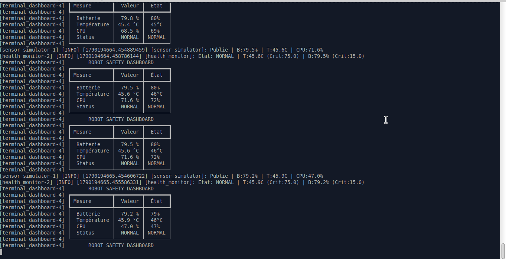
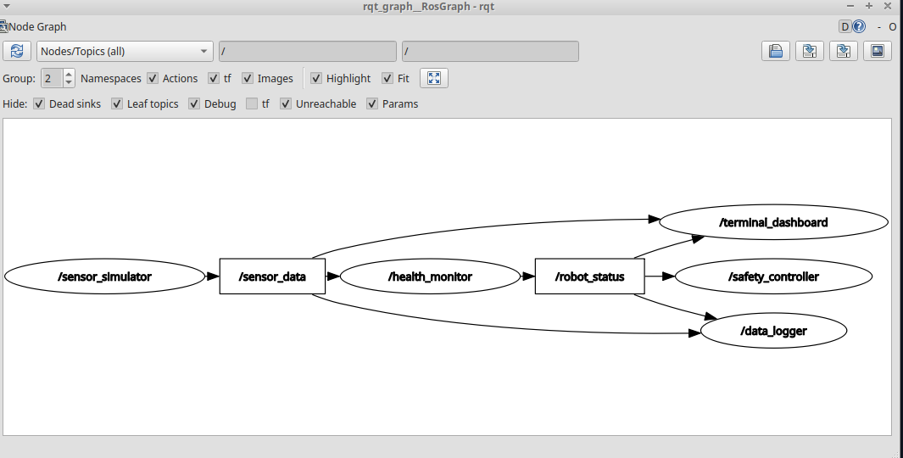
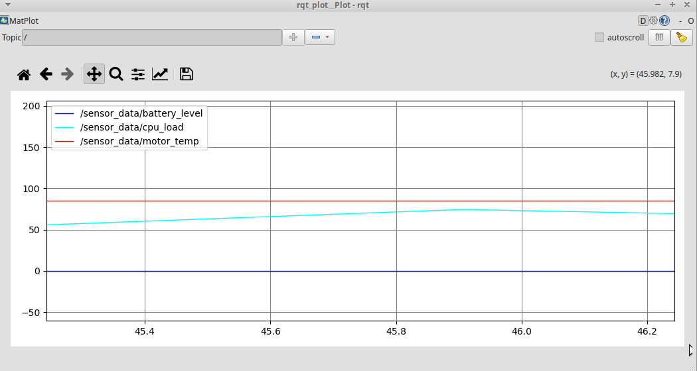
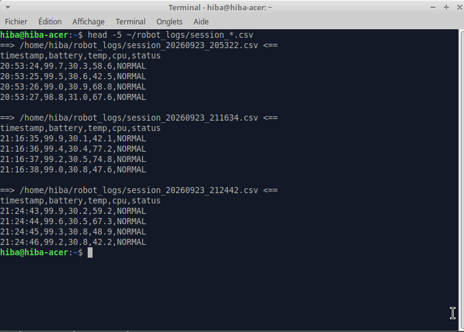

# 🤖 SafeBot — ROS 2

> Real-time health monitoring and autonomous safety system for industrial robots.  
> Built with **ROS 2 Lyrical** · **Python 3** · **Rich** · **rosbag2**

---

## 📋 Overview

An industrial-grade distributed monitoring system that tracks a robot's vital parameters in real time and triggers automatic safe shutdown when critical thresholds are reached — mimicking the safety logic found in real manufacturing robots.

---

## ✨ Features

| Feature | Description |
|---|---|
| 📊 Real-time monitoring | Battery, motor temperature, CPU load at 1 Hz |
| 🔁 3-state machine | `NORMAL` → `WARNING` → `CRITICAL` with edge-trigger logic |
| 🛑 Safe Mode | Automatic robot shutdown on critical state detection |
| 💻 Live terminal dashboard | Rich-powered table refreshed every 0.5s |
| 📁 CSV logging | Every reading timestamped and persisted to disk |
| ⚙️ Hot-reloadable config | Thresholds adjustable live via `ros2 param set` |
| 🎥 Session recording | Full rosbag2 record/replay support |
| 📈 Signal visualization | rqt_plot integration for real-time curves |

---

## 🏗️ Architecture

```
┌─────────────────────┐
│  sensor_simulator   │  Publishes SensorData @ 1 Hz
│     (Node 1)        │
└────────┬────────────┘
         │ /sensor_data (SensorData.msg)
         ▼
┌─────────────────────┐
│   health_monitor    │  Evaluates thresholds → state machine
│     (Node 2)        │
└────────┬────────────┘
         │ /robot_status (String: NORMAL / WARNING / CRITICAL)
         ▼
┌─────────────────────┐     ┌──────────────────────┐     ┌─────────────────┐
│  safety_controller  │     │  terminal_dashboard  │     │   data_logger   │
│     (Node 3)        │     │      (Node 4)         │     │    (Node 5)     │
│  Edge-trigger safe  │     │  Live Rich table      │     │  CSV on disk    │
│  mode activation    │     │  refresh @ 0.5s       │     │  every reading  │
└─────────────────────┘     └──────────────────────┘     └─────────────────┘
```

---

## 📸 Screenshots

### Live Terminal Dashboard (Rich)


### ROS 2 Node Graph (Architecture)


### Real-time Signal Visualization (rqt_plot)


### CSV Data Logging


---

## 🔄 State Machine

```
         bat > 30%          bat < 30%          bat < 15%
         temp < 60°C        temp < 75°C        temp > 75°C
              │                  │                  │
              ▼                  ▼                  ▼
          🟢 NORMAL  ──────► 🟡 WARNING ──────► 🔴 CRITICAL
                                                     │
                                              Safe Mode activated
                                              Robot halted
```

---

## 📦 Custom Message — `SensorData.msg`

```
float32 battery_level   # percentage (0.0 – 100.0)
float32 motor_temp      # degrees Celsius
float32 cpu_load        # percentage (0.0 – 100.0)
string  timestamp       # HH:MM:SS
```

---

## ⚙️ Configuration — `config/health_monitor_params.yaml`

```yaml
health_monitor:
  ros__parameters:
    temp_warn: 60.0
    temp_crit: 75.0
    batt_warn: 30.0
    batt_crit: 15.0
```

---

## 🚀 Installation

```bash
# Prerequisites
sudo apt install ros-lyrical-desktop python3-rich

# Clone and build
cd ~/ros2_ws1/src
git clone https://github.com/hibabhll/ros2-robot-safety-monitor.git
cd ..
colcon build
source install/setup.bash
```

---

## ▶️ Usage

```bash
# Launch all 5 nodes at once
ros2 launch robot_safety robot_safety.launch.py

# Adjust a threshold live (no restart needed)
ros2 param set /health_monitor temp_crit 80.0

# Visualize sensor curves in real time
rqt_plot /sensor_data/battery_level /sensor_data/motor_temp

# Record a full session
ros2 bag record -a -o safety_session

# Replay the recorded session
ros2 bag play safety_session
```

---

## 📂 Project Structure

```
ros2_ws1/src/
│
├── robot_safety/                    # Main package (nodes)
│   ├── robot_safety/
│   │   ├── sensor_simulator.py      # Node 1 — publishes sensor data
│   │   ├── health_monitor.py        # Node 2 — state machine + thresholds
│   │   ├── safety_controller.py     # Node 3 — edge trigger + safe mode
│   │   ├── terminal_dashboard.py    # Node 4 — live Rich terminal UI
│   │   └── data_logger.py           # Node 5 — CSV persistence
│   ├── launch/
│   │   └── robot_safety.launch.py   # One-command deployment
│   ├── config/
│   │   └── health_monitor_params.yaml
│   ├── package.xml
│   └── setup.py
│
└── robot_safety_interfaces/         # Separate package for messages
    ├── msg/
    │   └── SensorData.msg           # Custom message definition
    └── CMakeLists.txt
```

---

## 🛠️ Tech Stack

| Technology | Role |
|---|---|
| ROS 2 Lyrical | Distributed middleware |
| Python 3 / rclpy | Node implementation |
| Custom `.msg` | Typed multi-field messages |
| Rich | Live terminal dashboard |
| rosbag2 | Session recording & replay |
| rqt_plot | Real-time signal visualization |
| YAML params | Hot-reloadable configuration |
| CSV | Persistent data logging |

---

## 🗺️ Roadmap

- [x] Phase 1 — Core monitoring system (5 nodes, state machine, CSV)
- [ ] Phase 2 — FreeRTOS multi-task architecture on ESP32
- [ ] Phase 3 — Physical hardware deployment (STM32 + real sensors)
- [ ] Phase 4 — TinyML anomaly detection (Edge Impulse)

---

## 👩‍💻 Author

**Hiba Bouhlel** — IoT & Embedded Systems Engineer 🇹🇳  
ISSAT Sousse — L3 ISI, Specialization: IoT & Embedded Systems  
[](https://github.com/hibabhll)  
[](https://linkedin.com/in/bouhlel-hiba-425222361)

---

## 📄 License

Apache 2.0 — see [LICENSE](./LICENSE) for details.
